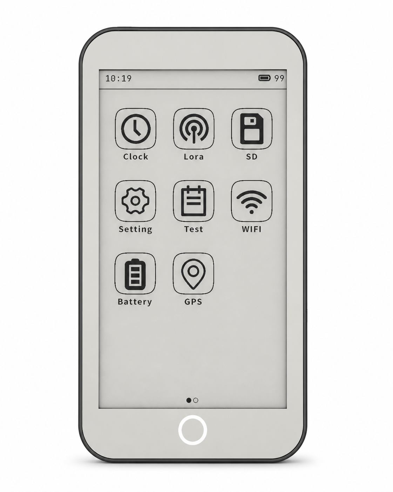
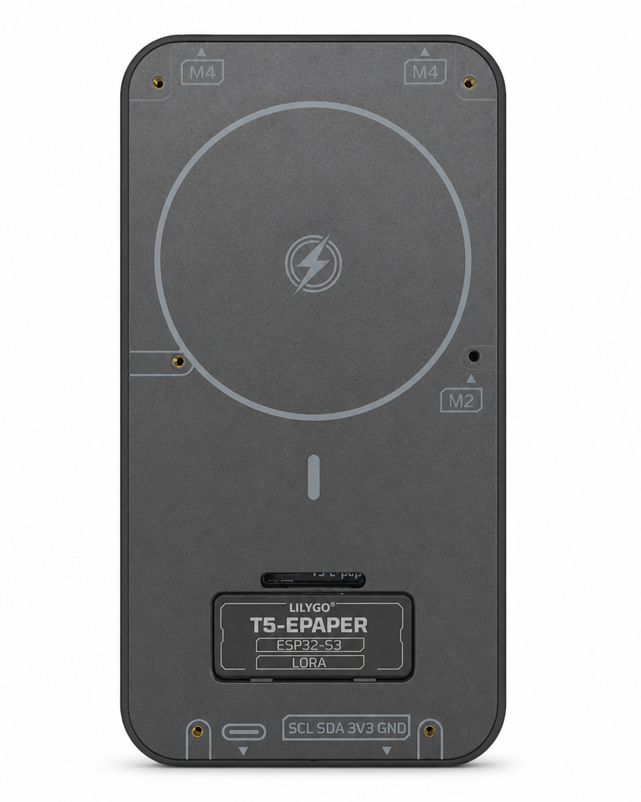
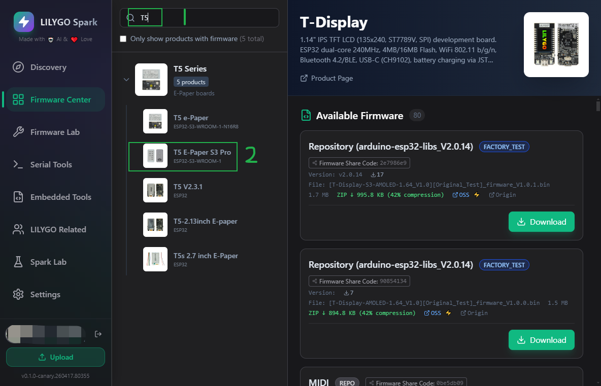

<h1 align = "center">🏆T5_E_Paper_S3_Pro🏆</h1>

  <b>English</b> | <a href="./README_CN.md">中文</a>

 
<!-- </a> -->
</a>
</a>

| Front | Back |
| :---: | :---: |
|  |  |

## :zero: Version 🎁

### 1、Version

|        version         | TPS65185 | GPS | LoRa |                                  Branch                                  |                                         Where to buy                                          |
| :--------------------: | :------: | :-: | :--: | :----------------------------------------------------------------------: | :-------------------------------------------------------------------------------------------: |
|   T5 E-Paper S3 Pro    |    ✅     |  ✅  |  ✅   |    [H752-01](https://github.com/Xinyuan-LilyGO/T5S3-4.7-e-paper-PRO)     |   [LilyGo Store](https://lilygo.cc/products/t5-e-paper-s3-pro?_pos=2&_sid=e9bdb39ec&_ss=r)    |
| T5 E-Paper S3 Pro Lite |    ✅     |  ❌  |  ❌   |    [H752-01](https://github.com/Xinyuan-LilyGO/T5S3-4.7-e-paper-PRO)     | [LilyGo Store](https://lilygo.cc/products/t5-e-paper-s3-pro-lite?_pos=1&_sid=e9bdb39ec&_ss=r) |
|          H752          |    ❌     |  ❌  |  ✅   | [H752](https://github.com/Xinyuan-LilyGO/T5S3-4.7-e-paper-PRO/tree/H752) |                                           Sold out                                            |

Note: The `Lite` version and the `Pro` version share the same schematic diagram, but the `Lite` version does not have LoRa and GPS.

## :one: Product 🎁

|       H752-01       | [T5 E-Paper S3 Pro](https://lilygo.cc/products/t5-e-paper-s3-pro) |
| :-----------------: | :---------------------------------------------------------------: |
|         MCU         |                         ESP32-S3-WROOM-1                          |
|    Flash / PSRAM    |                             16M / 8M                              |
|        Lora         |                              SX1262                               |
|         GPS         |                         MIA-M10Q / L76K                           |
|      Driver IC      |             ED047TC1 (4.7 inches, 960x540 , 16 gray)              |
|  Battery Capacity   |                           3.7V-1500mAh                            |
|    Battery Chip     |                  BQ25896 (0x6B), BQ27220 (0x55)                   |
|        Touch        |                           GT911 (0x5D)                            |
|         RTC         |                          PCF85063 (0x51)                          |
| E-link Power Driver |                          TPS65185 (0x68)                          |
|      IO Extend      |                         PCA9535PW (0x20)                          |

➡ **T5_E_Paper_S3_Pro Related projects**:

- [ [FastEPD](https://github.com/Xinyuan-LilyGO/FastEPD) ] : Optimized library for driving parallel eink displays with the ESP32

## :two: Update program 🎁

Before downloading the program, connect the device to your computer, select the corresponding COM port, and then set the device to download mode
- :one: Hold the BOOT key without releasing it
- :two: Click the RST button on the back and release
- :three: Finally, release the BOOT key

### 2.1. Use `LILYGO Spark` to download the program (Recommendation)

- Download the software from [LILYGO Spark](https://lilygo.cc/en-us/pages/lilygo-spark?srsltid=AfmBOoorTB7ptFu2LQNLRnoI2SA0zBGJTN6JpI9J3hmHEkKhBQSmeu0Y)

- Search for your device name in `LILYGO Spark` and download the corresponding program

examples:

| Firmware                        | Note                | Github                                                        |
| ------------------------------- | ------------------- | ------------------------------------------------------------- |
| T5_E_PAPER_S3_PRO_V1.0_20260506 | Factory program  | -                                                             |
| corsspoint_lilygo_t5s3_e_paper  | Reader program      | [t5s3-reader](https://github.com/ShallowGreen123/t5s3-reader) |

### 2.2. Use ESP official `flash_download_tool` to download the program

The demonstration examples are located in the `examples/factory` folder under the `firmware/` directory.

Reference [flash_download_tool](./docs/flash_download_tool/flash_download_tool.md)

## :three: Quick Start 🎁

🟢 PlatformIO is recommended because these examples were developed on it. 🟢 

### 3.1. PlatformIO

1. Install [Visual Studio Code](https://code.visualstudio.com/) and [Python](https://www.python.org/), and clone or download the project;
2. Search for the `PlatformIO` plugin in the `VisualStudioCode` extension and install it;
3. After the installation is complete, you need to restart `VisualStudioCode`
4. After opening this project, PlatformIO will automatically download the required tripartite libraries and dependencies, the first time this process is relatively long, please wait patiently;
5. After all the dependencies are installed, you can open the `platformio.ini` configuration file, uncomment in `example` to select a routine, and then press `ctrl+s` to save the `.ini` configuration file;
6. Click :ballot_box_with_check: under VScode to compile the project, then plug in USB and select COM under VScode;
7. Finally, click the :arrow_right:  button to download the program to Flash;

### 3.2. Arduino IDE

1. Install [Arduino IDE](https://www.arduino.cc/en/software)

2. Copy all files under `this project/lib/` and paste them into the Arduion library path (generally `C:\Users\YourName\Documents\Arduino\libraries`);

3. Open the Arduion IDE and click `File->Open` in the upper left corner to open an example in `this project/example/xxx/xxx.ino` under this item;

4. Then configure Arduion. After the configuration is completed in the following way, you can click the button in the upper left corner of Arduion to compile and download;

| Arduino IDE Setting                  | Value                              |
| ------------------------------------ | ---------------------------------- |
| Board                                | ***ESP32S3 Dev Module***           |
| Port                                 | Your port                          |
| USB CDC On Boot                      | Enable                             |
| CPU Frequency                        | 240MHZ(WiFi)                       |
| Core Debug Level                     | None                               |
| USB DFU On Boot                      | Disable                            |
| Erase All Flash Before Sketch Upload | Disable                            |
| Events Run On                        | Core1                              |
| Flash Mode                           | QIO 80MHZ                          |
| Flash Size                           | **16MB(128Mb)**                    |
| Arduino Runs On                      | Core1                              |
| USB Firmware MSC On Boot             | Disable                            |
| Partition Scheme                     | **16M Flash(3M APP/9.9MB FATFS)**  |
| PSRAM                                | **OPI PSRAM**                      |
| Upload Mode                          | **UART0/Hardware CDC**             |
| Upload Speed                         | 921600                             |
| USB Mode                             | **CDC and JTAG**                   |

### 3.3. Folder structure

~~~
├─boards      : Board configuration files for PlatformIO;
├─DXF         : Board and shell size drawings (DXF/DWG format);
├─docs        : Documentation images;
├─examples    : Example projects for testing various hardware features;
├─firmware    : Pre-compiled factory firmware;
├─hardware    : Schematics and chip datasheets;
├─lib         : Third-party libraries used in the project;
~~~

### 3.4. Examples

| Example | Path | Description |
|:------- |:---- |:---------- |
| bq25896 | examples/bq25896 | BQ25896 battery charger IC test |
| bq27220 | examples/bq27220 | BQ27220 fuel gauge IC test |
| factory | examples/factory | Factory firmware program |
| GPS | examples/GPS | GPS module test (outdoor required) |
| io_extend | examples/io_extend | PCA9535PW I2C IO expansion IC test |
| lora_recv | examples/lora_recv | SX1262 LoRa receive test |
| lora_send | examples/lora_send | SX1262 LoRa send test |
| lvgl_test | examples/lvgl_test | LVGL graphics library test |
| nvs_test | examples/nvs_test | NVS (non-volatile storage) test |
| sd_card | examples/sd_card | SD card read/write test |
| touch | examples/touch | GT911 capacitive touch IC test |

## :four: Pins 🎁

### 4.1 Pin mapping

[./docs/pinmap.md](./docs/pinmap.md)

### 4.2 Pin definition

[./docs/pin_define.md](./docs/pin_define.md)

## :five: Test 🎁

Sleep power consumption.

## :six: FAQ 🎁

|                         Document                         |                           Link                            |
| :------------------------------------------------------: | :-------------------------------------------------------: |
| How to download programs through `flash_download_tool` ? | [dosc](./docs/flash_download_tool/flash_download_tool.md) |

## :seven: Schematic & 3D 🎁

For more information, see the `./hardware` directory.

Schematic : [T5_E-Paper-S3-Pro](./hardware/T5%20E-paper%20S3%20Pro%20V1.0%2024-12-24.pdf)

[Board size](./DXF/H752-Board%20size.dxf)  

[Shell size](./DXF/H752-Shell%20size.dwg)
